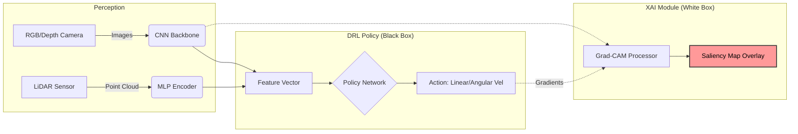

# 🤖 A Visual Approach to Explainable RL for Robotic Navigation

[](https://www.mdpi.com/2413-4155/6/1/5)
[](https://opensource.org/licenses/MIT)
[](https://pytorch.org/)
[]()

> **Official repository for the paper:**  
> *Medak, D.; Sanfilippo, F. "A Visual Approach to Explainable Reinforcement Learning for Robotic Navigation." Sci 2024, 6, 5.*

This repository contains the implementation of a Deep Reinforcement Learning (DRL) navigation agent enhanced with **Explainable AI (XAI)**. It provides real-time visual attention maps (Grad-CAM) to interpret *why* the robot chooses specific navigation actions.

## 👁️ Visual Demonstration

The core contribution of this work is "opening the black box" of the navigation policy.

<!-- REPLACE THESE LINKS WITH YOUR OWN SCREENSHOTS/GIFS FROM THE PAPER OR SIMULATION -->
| **Camera Input** | **Saliency Map (XAI)** | **Interpretation** |
| :---: | :---: | :--- |
|  |  | **Obstacle Avoidance:** The agent focuses on the corner edge (red hot-spot) to decide on a left turn. |
|  |  | **Goal Seeking:** Attention is focused on the open corridor center, indicating a "Forward" action. |

## 📖 Abstract

Deep Reinforcement Learning has revolutionized robotic navigation, yet the decision-making process of neural networks remains opaque. This project implements a **Visual XAI Framework** that:

1.  **Trains** a mapless navigation agent using PPO/DQN algorithms.
2.  **Extracts** feature activation maps from the CNN layers.
3.  **Visualizes** decision criteria via Grad-CAM (Gradient-weighted Class Activation Mapping).

This allows researchers to distinguish between "intelligent behavior" and "environment exploitation" (e.g., an agent detecting a goal based on floor texture rather than geometry).


## 🏗️ System Architecture

The agent processes visual data (RGB/Depth) and sensor data (LiDAR) to output velocity commands. The XAI module runs in parallel to generate explanations.



## 🚀 Installation

### Prerequisites
*   Python 3.8+
*   PyTorch 1.10+
*   OpenCV
*   (Optional) ROS Noetic or Unity ML-Agents for simulation

# 1. Clone the repository
git clone https:[//github.com/your-username/visual-xai-navigation.git](https://github.com/MdFahimShahoriar/Textile-Visual-Pollutants-Dataset.git)
cd visual-xai-navigation

# 2. Create a virtual environment
python -m venv venv
source venv/bin/activate  # on Windows use: venv\Scripts\activate

# 3. Install dependencies
pip install -r requirements.txt

## 🏃 Usage

### 1. Training the Agent
To train the agent in the standard environment:

```bash
python train.py --env "CorridorEnv" --algo PPO --episodes 10000
```

### 2. Evaluation with Explainability
To load a trained model and generate the visual heatmaps:

```bash
python evaluate.py --model_path ./checkpoints/best_agent.pt --visualize_attention True
```

*This will open a window showing the live camera feed overlaid with the attention heatmap.*

---

## 📊 Key Findings

Based on the experiments detailed in the paper:

*   **Edge Detection:** The agent learns to identify walls primarily by vertical edges rather than texture.
*   **Dynamic Objects:** Saliency maps show high activation on moving obstacles (e.g., walking humans) before the LiDAR sensor is fully triggered.
*   **Failure Analysis:** We identified cases where the agent failed because it was "looking" at irrelevant background noise—something impossible to diagnose without XAI.

---

## 📂 Repository Structure

```text
.
├── assets/                 # Images and Gifs for documentation
├── configs/                # Hyperparameters (yaml)
├── src/
│   ├── agents/             # PPO/DQN Agent implementations
│   ├── models/             # CNN/MLP Neural Network architectures
│   └── xai/                # Grad-CAM and visualization tools
├── envs/                   # Simulation environments
├── train.py                # Training entry point
├── evaluate.py             # Evaluation and Visualization entry point
└── README.md
```

---

## 🔗 Citation

If you use this code or the visual concepts in your research, please cite the original MDPI paper:

```bibtex
@article{sci6010005,
  title={A Visual Approach to Explainable Reinforcement Learning for Robotic Navigation},
  author={Medak, Duje and Sanfilippo, Filippo},
  journal={Sci},
  volume={6},
  year={2024},
  number={1},
  article-number={5},
  url={https://www.mdpi.com/2413-4155/6/1/5},
  issn={2413-4155},
  doi={10.3390/sci6010005}
}
```

---

## 📄 License

Distributed under the MIT License. See `LICENSE` for more information.

---

<p align="center">
  <sub>Built based on the research by D. Medak and F. Sanfilippo. Implementation by [Your Name].</sub>
</p>

